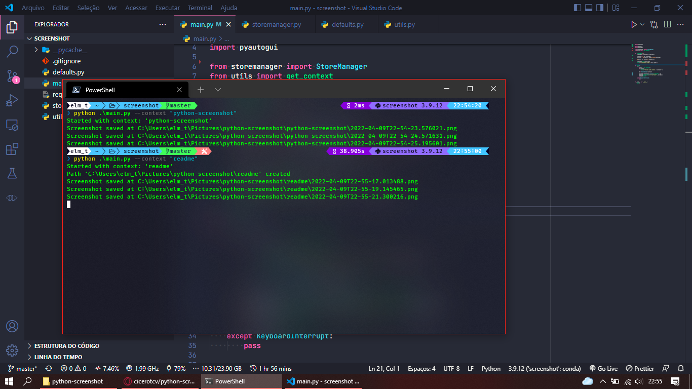

# Python Screenshot


Takes an screenshot when a given hotkey is pressed (defaults to `ctrl+alt+enter`).

Works in background.

## Usage

Run the program as seen below and then trigger the screenshot pressing `ctrl+alt+enter`

```sh
# with context
# screenshots are saved at "$PICTURES/python-screenshot/context name/"
$ python3 -m main.py --context "context name"


# without context
# screenshots are saved at "$PICTURES/python-screenshot/"
$ python3 -m main.py
```

## Demo


